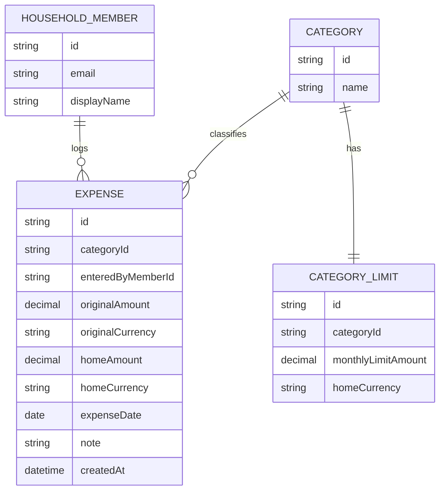

# Domain Model

The household ledger is shared: every expense, category, and limit belongs to
the household, not to an individual member.

- **HOUSEHOLD\_MEMBER** is a household member's identity, resolved from the
signed-in Thunder session — not a row this app creates.
- **CATEGORY** is a household-wide grouping (e.g. Groceries, Utilities); each
has at most one **CATEGORY\_LIMIT** (a monthly cap, expressed in the
household's home currency).
- **EXPENSE** always carries both the amount as entered (`originalAmount` /
`originalCurrency`) and the converted amount used for reporting
(`homeAmount` / `homeCurrency`), so a foreign-currency entry is never lossy.

