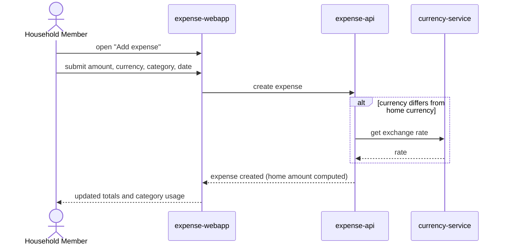

# Log an expense

A household member signs in, logs a new expense (possibly in a foreign
currency), and sees it reflected in the shared totals.

```mermaid
sequenceDiagram
    actor Member as Household Member
    participant expense-webapp
    participant expense-api
    participant currency-service

    Member->>expense-webapp: open "Add expense"
    Member->>expense-webapp: submit amount, currency, category, date
    expense-webapp->>expense-api: create expense
    alt currency differs from home currency
        expense-api->>currency-service: get exchange rate
        currency-service-->>expense-api: rate
    end
    expense-api-->>expense-webapp: expense created (home amount computed)
    expense-webapp-->>Member: updated totals and category usage
```

