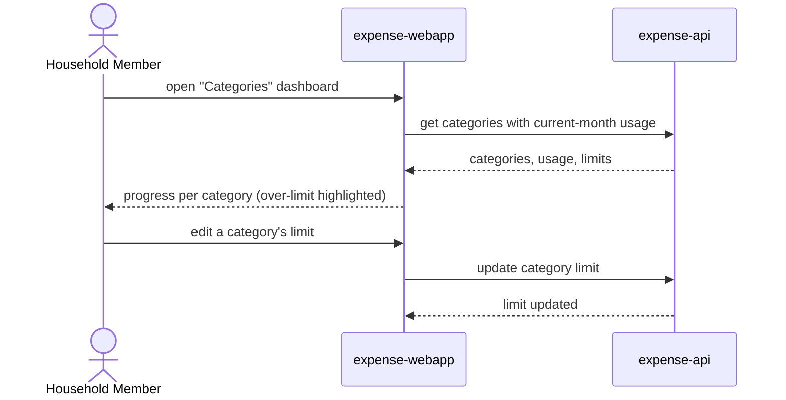

# Track category limits

A household member reviews spending against each category's monthly limit
and adjusts the limit when needed.

```mermaid
sequenceDiagram
    actor Member as Household Member
    participant expense-webapp
    participant expense-api

    Member->>expense-webapp: open "Categories" dashboard
    expense-webapp->>expense-api: get categories with current-month usage
    expense-api-->>expense-webapp: categories, usage, limits
    expense-webapp-->>Member: progress per category (over-limit highlighted)
    Member->>expense-webapp: edit a category's limit
    expense-webapp->>expense-api: update category limit
    expense-api-->>expense-webapp: limit updated
```

